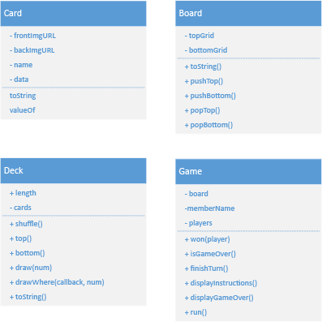

# Cards

## License

Released under [MIT](/LICENSE) by [@Mauricio](https://github.com/mjlomeli).

**Email** : [Mauricio](mailto:mauricio.jr.lomeli@gmail.com)

## Purpose

This is a recreation of the Solitaire card game entirely out of Javascript and HTML5. Its primary purpose is as a proof
of concept.

### In Cards, users will be able to:

* Drag and drop_test
* Card selection
* Reset game
* Visualize score
* More TBA after completion of above

### In addition, this project will include:

* A comprehensive README
* Instructional guide
* API referencing image and card data

### Technologies, Libraries, APIs

* Looking into sound libraries
* Looking into animation renderers (sfx)

## Structure

Have split the objects into 5 modules:

1. Card
    - Has a shape
    - Front face image
    - Back face image
    - Flippable
    - Id
    - Draggable
2. Deck
    - Is a data structure of Cards.
    - Shuffles
    - Draws card(s)
3. Board
    - Links cards to positions on a grid.
    - Background
    - Datastructure is hash optimized.
4. Game
    - Player takes turns to solve the game.
    - Is all the logic for making the rules of the game.
5. Utilities
    - Cartesian product
    - Immutable matrix multiplication.
    - Checks system for compatible environments (e.g. Web or NodeJs).
    - Debugging tools.
    - Proxy tools.
    - Directory and file operations.
6. Tutorial
   - Display instructions for the player to learn how to play.
   - Pops up quotes.

## Goals

#### Day 1: _Wireframe & UML_

* _Design a wireframe concept and upload design details._

#### Day 2: _Skeleton Setup_

- Create the skeleton of each structure
- Test on command line

#### Day 3: _Canvas Skeleton_

- Create the objects.

#### Day 4: _Apply Objects_

- Bind the objects to events.

#### Day 5: _Debug_

#### Day 6-7: _Improve Project_
- Improve the game with additional visuals.

## Checklist

### Live Project

- [x] Includes links to your Github and LinkedIn.

- [x] Landing page/modal with obvious, clear instructions.

- [x] Interactivity of some kind.

- [x] Well styled, clean frontend.

- [x] If it has music, the option to mute or stop it.

### Production README

- [x] Link to live version.

- [ ] Instructions on how to play/interact with the project.

- [x] List of technologies / libraries / APIs used.

- [ ] Technical implementation details with (good-looking) code snippets.

- [x] To-dos / future features.

- [X] No .DS_Store files / debuggers / console.logs.

- [X] Organized file structure, with /src and /dist directories.

### Contributors

<table>
  <tr>
      <td id="mauricio" align="center">
         <a href="https://github.com/mjlomeli">
          
         <b>Mauricio Lomeli</b></a> 
         <label>Code</label>
      </td>
      <td id="charis" align="center">
         <a href="https://github.com/Eruanne2">
          
         <b>Charis Ginn</b></a> 
         <label>Mentor</label>
      </td>
      <td id="paulo" align="center">
         <a href="#">
          
         <b>Paulo Bocanegra</b></a> 
         <label>Debugging</label>
      </td>
      <td id="mike" align="center">
         <a href="https://github.com/mwmadsen67">
          
         <b>Mike Madsen</b></a> 
         <label>Debugging</label>
      </td>
   </tr>
</table>
